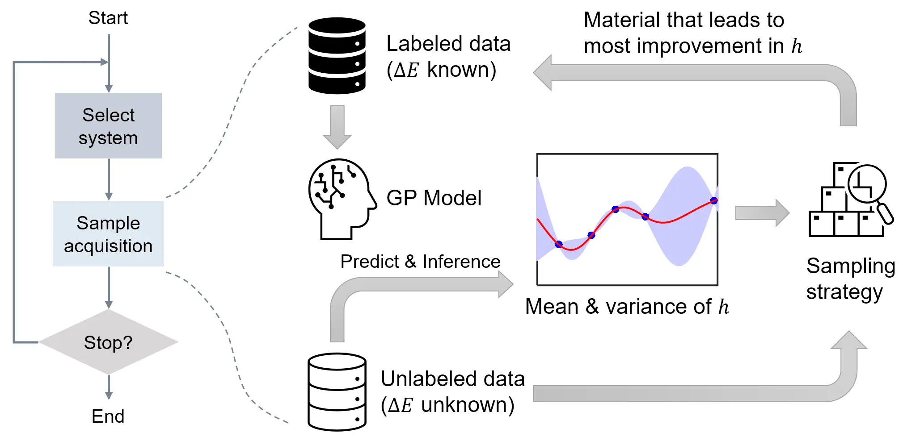

# Entropy-Targeted Active Learning

[](https://zenodo.org/badge/latestdoi/521793176)

This repository contains an implementation of entropy-targeted active learning (ET-AL) for materials data bias mitigation, associated with our paper.



## Copyright
This code is open-sourced under the MIT license. Feel free to use all or portions for your research or related projects so long as you provide the following citation information:

Zhang, H., Chen, W. W., Rondinelli, J. M., and Chen W. (2022). [ET-AL: entropy-targeted active learning for bias mitigation in materials data](https://arxiv.org/abs/2211.07881). arXiv:2211.07881.

```
@misc{zhang2022etal,
    author = {Zhang, Hengrui and Chen, Wei Wayne and Rondinelli, James M. and Chen, Wei},
    title = {ET-AL: entropy-targeted active learning for bias mitigation in materials data},
    howpublished = {arXiv preprint arXiv:2204.10532},
    year = {2022},
    doi = {10.48550/ARXIV.2211.07881},
    url = {https://arxiv.org/abs/2211.07881},
    publisher = {arXiv}
}
```

## Descriptions
`etal_main.py` implements the ET-AL algorithm and demonstrates on the Jarvis-CFID dataset.

`ML_comparison.ipynb` compares several ML models on different training sets.

`plot_data.ipynb` is used for creating relevant plots for visualization.

`datasets/` provides data required for reproducing the results in our paper.

`results/` contains data generated in ET-AL demonstration on the Jarvis-CFID dataset

`utils/` contains tools for data pre-processing:

- `Jarvis_data.ipynb` is used for retrieving, cleaning the Jarvis CFID data and generating graph embeddings.
- `Jarvis_featurize.ipynb` generates physical descriptors for the Jarvis CFID data.
- `compound_featurizer.py` automatic tool for physical descriptors
- `cgcnn/` the CGCNN model for graph embeddings

## Usage
### Set up environment

Navigate to the code directory and create the environment:

```bash
conda env create -f environment.yml
```

Then activate the new environment:

```bash
conda activate gp-torch
```

### Data preparation
Organize the dataset in a Data Frame and change the data paths in `etal_main.py`. For demonstration purposes, a dataset derived from the Jarvis CFID data is provided in `datasets/`: the crystal structures and properties are in `data_cleaned.pkl`, and the graph embeddings are in `cgcnn_embeddings.pkl`.

*Note: [`git-lfs`](https://git-lfs.com/) is required for `data_cleaned.pkl` to be downloaded properly. Please download the file manually if you do not have `git-lfs`.

### Run code

1. Set up experimental parameters in `etal_main.py`: `n_iter` for maximum number of ET-AL iterations, `n_test` for number of data points left as test set, `n_unlabeled` for number of data points left as unlabeled. Edit the following part to change the selection of unlabeled data.

2. Run ET-AL model:

  ```bash
  python etal_main.py
  ```

3. Run `ML_comparison` to compare ML models on training set generated by ET-AL sampling and random sampling.

4. Use `plot_data` to visualize the results and reproduce plots in the paper.

